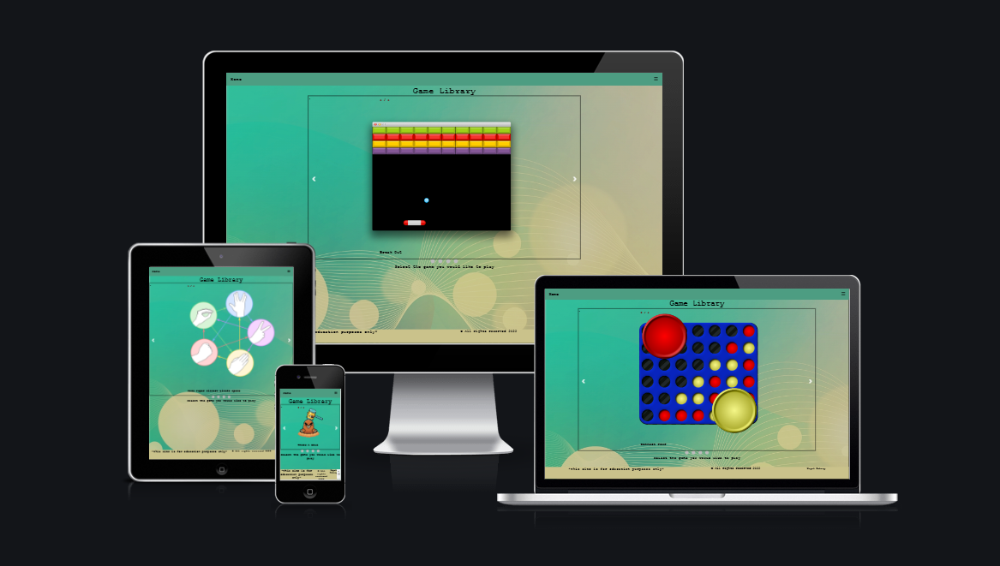
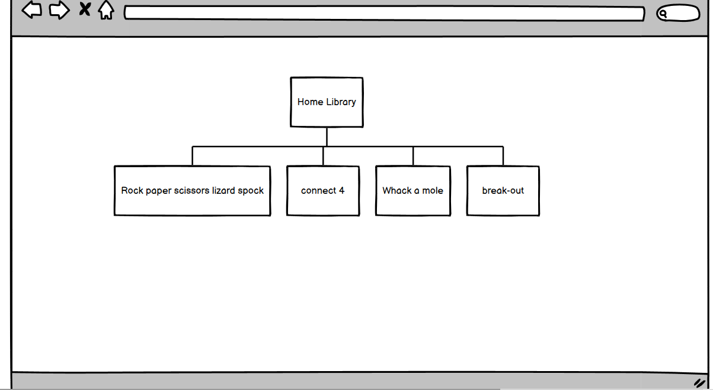
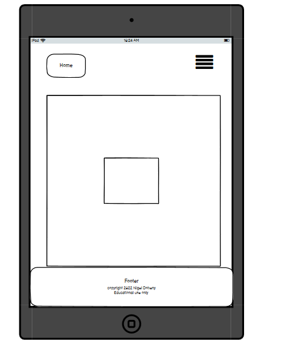
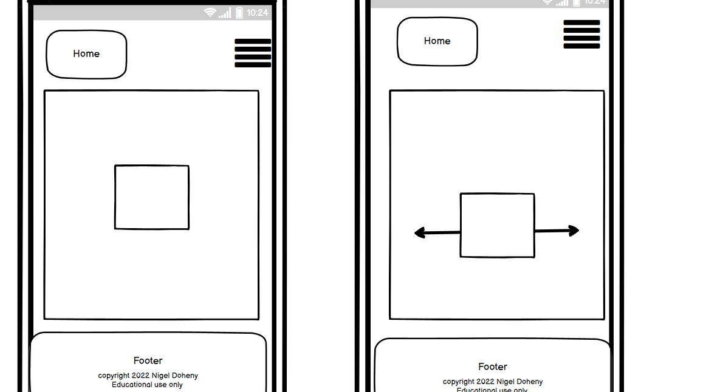
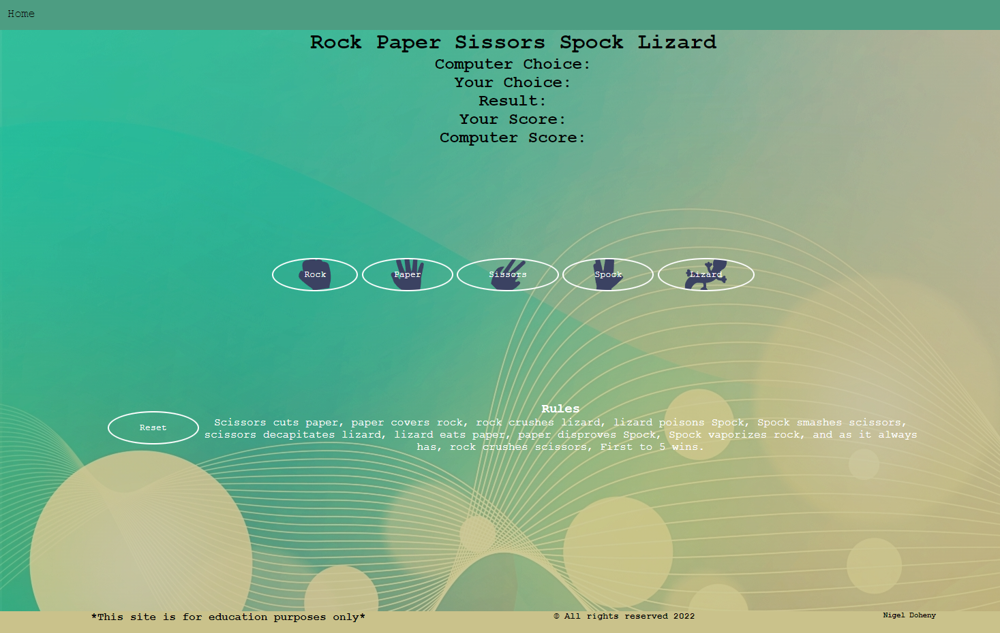
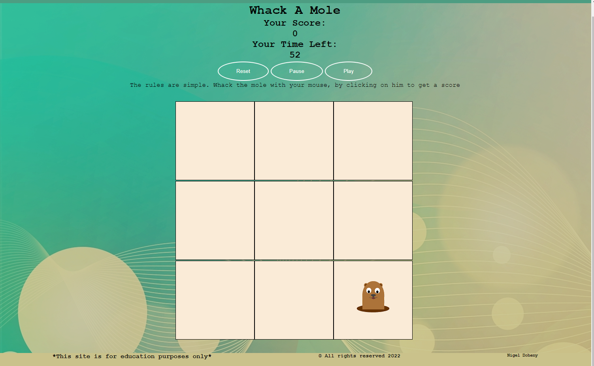
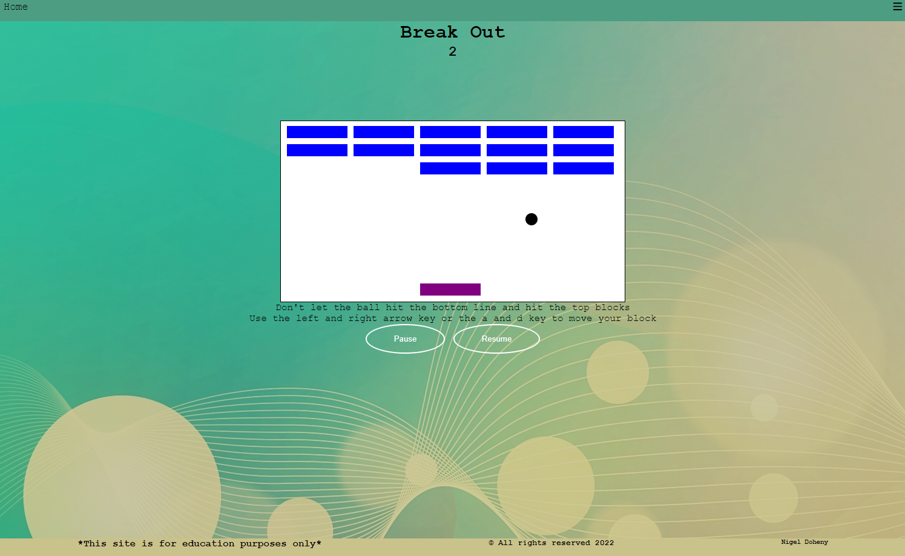
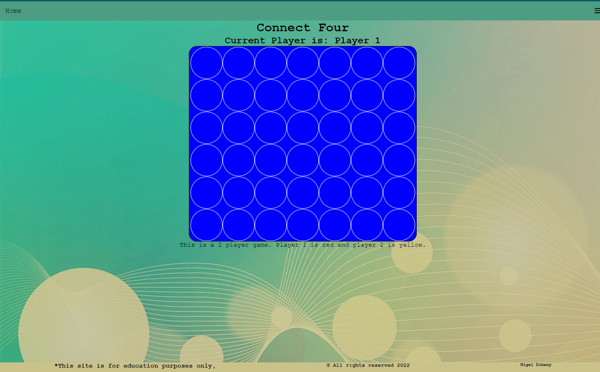
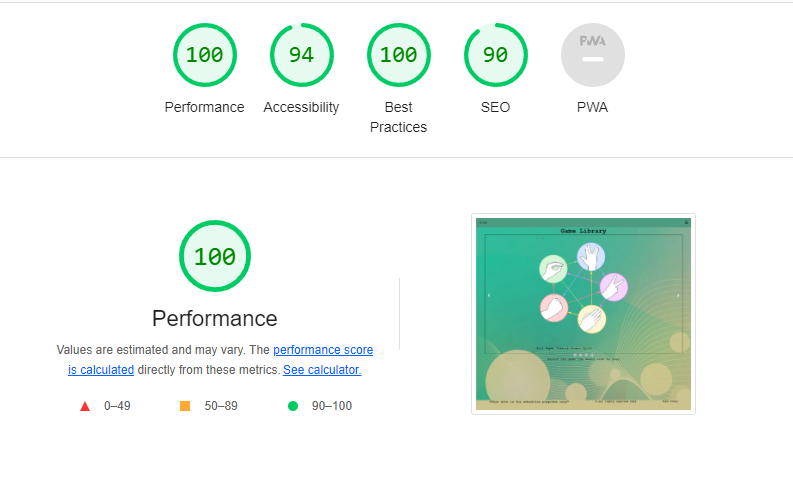

# Game Library
My website [live here](https://excellentwish.github.io/Project-Portfolio-2-CI/)

## Project Portfolio 2- JavaScript Essentials - Code Institute.
### Site Overview

This is a simple website that has 4 games from my childhood and I belive other people too. I wanted a responsive website and the best way to be responive is to play games. 

# Table of Contents
+ [Site Overview](#site-overview)
+ [Planning stage](#planning-stage)
+ [What's on the table?](#what's-on-the-table?)
+ [Actual website](#Actual-website)
+ [Tech used](#tech-used)
+ [Testing](#testing)
+ [Deployment](#deployment)
+ [Credits](#credits)

   
# Planning stage
### Target Audiences:
* The audiences for this is for retro gamers. Or gamers in gerneral. A place with a small collection of games from our past.

## User Experience
* I want the games to be simple and from our past. I started with Rock,Paper Sissors but decided to change it to the Rock,Paper,Sissors Lizard Spock too add alittle bit of difficulty to one of our most basic games that we played as children.
* For the design of this website, I wanted to keep it as simple as possible

## Site Aims:
* I wanted to learn JavaScript and probably the most engaging way is through games and the best way for programs to be responive is through games.

## How Is This Will Be Achieved:
* By using JavaScript ,Html and CSS

## Wireframes
To organize my thoughts and prevent scope creep, I created wireframes for this project. Below are wireframes to each of the mobile and desktop versions.

  
 
 For computers and laptops, there will be the main div and then inside will be the main game area or game selector
 
 For Tablet I will keep the same layout as well as mobile.
 

 Color Scheme
I found a light theme from powerpoint that I like and thought it had a calming feel about it.

# What's on the table?
The header element stays on the top of the page. It contains the navigation links in a hamburger menu as it seems to be industry standard now and provide a more pleasant UX and adheres to popular conventions better.

The navigation will be in the header, and the header will be on all pages were the user can navigate to different games or home.

**The header element** 
Using it for navigation to index page and a hamburger menu to link to other pages 

**The navigation** 
Using a hamburger menu 
**The Game Library theme** 
Used a powerpoint light image as it looks nice and modern
**The information** 
The information is the rules for the games. Some are self explanatory
**The Games** 

##  1. Rock Paper Scissors Lizard Spock

It is a simple JS game that checks for win, loss or draw against computer choice. It uses basic if/else and forEach condtions with simple HTML and CSS.

Rock Paper Scissors is a fun game tradionally played by two people using their hands to make the rock paper scissors signs.This game has the modern twist from The Big Bang Theroy to add spock and lizard. This game the user and computer will choose one of the Five icons (rock, paper, scissors, spock and lizard) available for selection. Paper covers rock,rock crushes lizard, lizard poisons Spock, Spock smashes scissors, scissors decapitates lizard, lizard eats paper, paper disproves Spock, Spock vaporizes rock, and as it always has, rock crushes scissors. If both players select the same shape, the game is a draw.

First one between the user and computer to get to FIVE points wins the game. This is a great game for all age groups and easy to learn. So go on over and start playing, this game is so much fun!

it uses following js basic methods:

 - getElementById
 - addEventListener
 - forEach
 - querySelectorAll
 - Math.random()
 - innerHTML
 - event.target. id
 - Math.floor()

##   2. Whack-a-mole

In this game we have build a grid that randomly display the mole that we have to click on to get points in our defined time period.

Whack-a-mole is a fun game tradionally played by one player. In the funfair or carnival the player would use the hammer to hit the mole for a point. This uses the mouse as the hammer. See ho many points you can get in 1 minute. It has the function to reset it, pause and play.
it uses following js basic methods:

 - querySelectorAll
 - querySelector
 - Math.random()
 - Math.floor()
 -  forEach
 - addEventListener
 - TextContent
 - Alert
 - id
 - setInterval()
 - clearInterval()

##  3. Breakout

In this game we have build a 2D breakout in which you have to break all the blocks  infront of you.

In Break out its was a game from the Atari game console. This retro game, you bounce the ball from your bloack to destroy the other blocks. Its a fun single player game from the 80's. Use the arrow keys left and right to move or you can use the A key and D key to move.

it uses following js basic methods:

 - querySelector                                              
 - class
 - constructor
 - this
 - bottomLeft
 - bottomRight
 - topLeft
 - topRight
 - classList.add()
 - createElement
 - style.left
 - style.bottom
 - appendChild()
 - event.key
 - switch
 - setInterval()
 - clearInterval()
 - removeEventListener()
 - length
 - splice()
 - classList.remove()
 - Array.from()

##  4. Connect Four

This is quite a harder game to build in which instead of modulus approad we have define indexs to create a match

Connect 4 is the classic children's game designed for two players that need to connect four of their chips in a row either vertically, horizontally or diagonally to win. This is a two player game like the original game and has red vs yellow.

it uses following Javascript methods:

 - querySelector                                              
 - querySelectorAll
 - length
 - classList.contains()
 - addEventListener()
 - innerHTML
 - onClick
 - classList.add()
 - alert

**Typography**
Used Courier New', Courier, monospace

# Tech used 
 For this project I used HTML and CSS and JavaScript.
 I used code from Web Dev Simplified from youtube.
 I followed the Free code camp javascript course and youtube lesson from Ania Kubów
 I used my other git hub repos for testing.
 I created the favicon.ico using https://www.favicon.cc/

 

# Testing
 Making the page responsive was a real challange. 
 Using the website https://ui.dev/amiresponsive?url=https://excellentwish.github.io/Project-Portfolio-2-CI/ to adjust for mobiles, Tablets and PC
 Issues for break out, getting it to fit for mobile.
 Issues for index page was getting the images to line up in the center.
 Used other github repos for testing, links can be found below. 
 https://github.com/ExcellentWish/Project_Portfolio_2 I abandoned and started again with this project
 https://github.com/ExcellentWish/FCC-Retro-games Followed a youtube video which inspired this project
 https://github.com/ExcellentWish/bookcase for the index page.

I used the https://validator.w3.org/ to test my html code.
I used https://jigsaw.w3.org/css-validator/ to test my CSS code.
I used https://jshint.com/ to test my JavaScript code.
I also used lightHouse for desktop.

# Deployment
I deployed the page on GitHub pages via the following procedure: -

1. From the project's [repository](https://github.com/ExcellentWish/Project-Portfolio-2-CI), go to the **Settings** tab.
2. From the left-hand menu, select the **Pages** tab.
3. Under the **Source** section, select the **Main** branch from the drop-down menu and click **Save**.
4. A message will be displayed to indicate a successful deployment to GitHub pages and provide the live link.

You can find the live site via the following URL - [Project 2](https://excellentwish.github.io/Project-Portfolio-2-CI/)

# Credits 
My Mentor Rahul Lakhanpal who helped me develop this project.
To Anna Greaves and her Love math [project](https://learn.codeinstitute.net/courses/course-v1:CodeInstitute+LM101+2021_T1/courseware/2d651bf3f23e48aeb9b9218871912b2e/234519d86b76411aa181e76a55dabe70/)
## Media
Google fonts [cabin](https://fonts.google.com/specimen/Cabin?query=cabin)
[Font awesome](https://fontawesome.com/kits/0f96215e04/use)

Rock Paper sissors lizard spock found on https://www.svgrepo.com/

https://www.w3schools.com/howto/howto_js_mobile_navbar.asp for the hamburger menu

https://www.youtube.com/watch?v=9HcxHDS2w1s Web Dev Simplified for Library
Reference codes 
https://www.w3schools.com/howto/howto_js_mobile_navbar.asp

whack a mole image found https://flyclipart.com/whack-a-mole-mole-png-57119 edited with gimp

https://www.pngwing.com/ for images for index page
https://www.w3schools.com/howto/howto_js_slideshow.asp for index main navigation
Background image from powerpoint
https://www.youtube.com/watch?v=ec8vSKJuZTk&t=3746s inspired by Ania Kubów  https://github.com/kubowania